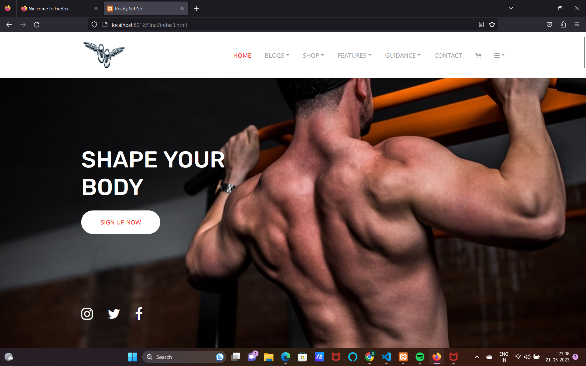
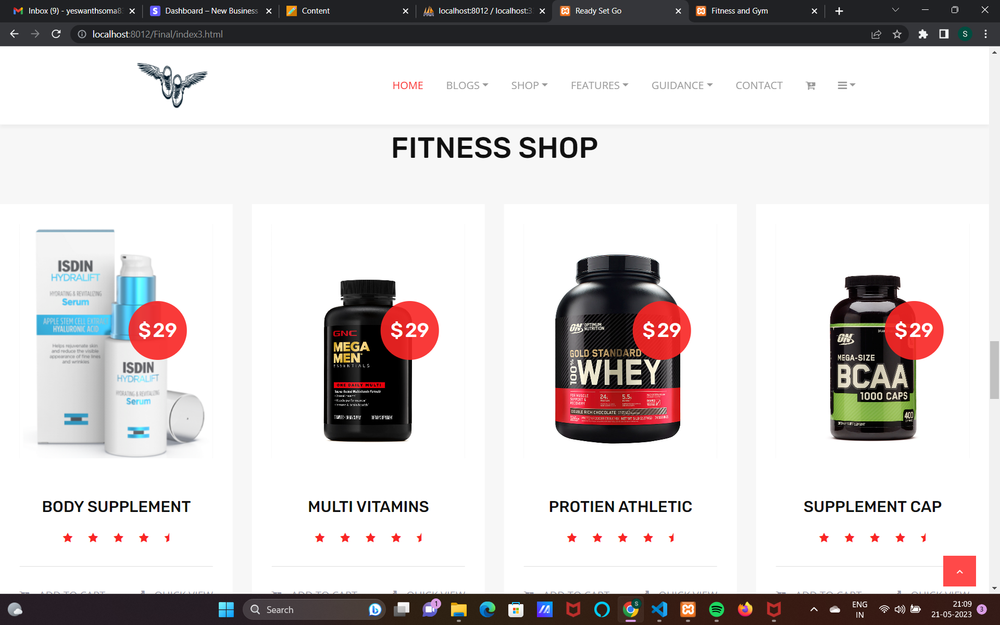
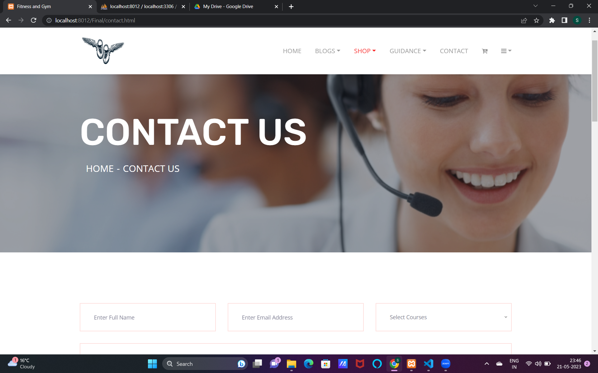

# ReadySetGo

**ReadySetGo** is a dynamic full-stack website built with HTML, CSS, and JavaScript. It offers a seamless user experience with responsive design, interactive features, and efficient performance. Whether you're looking to showcase your portfolio, create an online store, or build a community platform, ReadySetGo provides the tools and flexibility to bring your vision to life.

## Table of Contents

- [Features](#features)
- [Screenshots](#screenshots)
- [Technologies Used](#technologies-used)
- [Installation](#installation)
- [Usage](#usage)
- [Contributing](#contributing)
- [License](#license)
- [Acknowledgements](#acknowledgements)
- [Contact](#contact)

## Features

- **Responsive Design**: Ensures optimal viewing experience across various devices and screen sizes.
- **Interactive Elements**: Includes dynamic navigation bars, sliders, modals, and forms to enhance user engagement.
- **SEO Optimized**: Implements best practices for search engine optimization to improve visibility.
- **Performance Optimized**: Fast loading times and efficient code to provide a smooth user experience.
- **Cross-Browser Compatibility**: Compatible with all major browsers for a consistent experience.
- **Customizable Components**: Easily adaptable components to fit your project's specific needs.

## Screenshots

*Add screenshots of your website here to showcase its features and design.*

### Home Page



### About Us



### Contact Form



### Responsive View


*Ensure that you place your screenshots in a `screenshots` folder within your repository and update the image paths accordingly.*

## Technologies Used

- **HTML5**: Structuring the content and layout of the website.
- **CSS3**: Styling and designing the visual aspects, including layouts, colors, and fonts.
- **JavaScript**: Adding interactivity and dynamic functionality to the website.
- **Responsive Frameworks**: Utilized frameworks like Bootstrap or Flexbox for responsive design (if applicable).
- **Version Control**: Managed using Git and hosted on GitHub for collaboration and version tracking.

## Installation

To get a local copy of the project up and running, follow these simple steps:

1. **Clone the Repository**

   ```bash
   git clone https://github.com/yourusername/readysetgo.git
   ```
2. **Navigate to the Project Directory**
   ```bash
   cd readysetgo
   ```
3.**Open the Project in Your Preferred Code Editor**
```bash
code.
```
4.**Open index.html in Your Browser**

